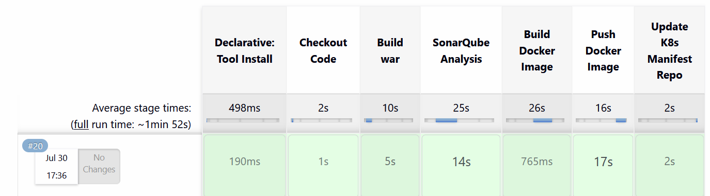
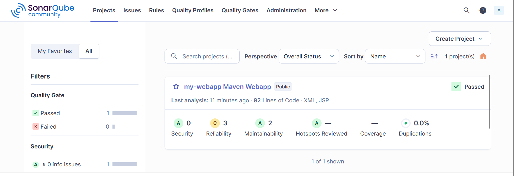
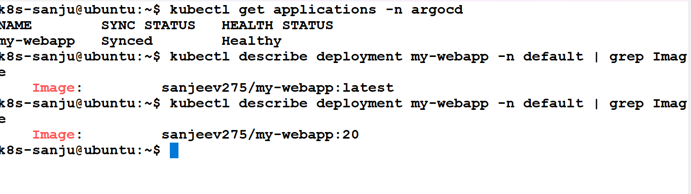
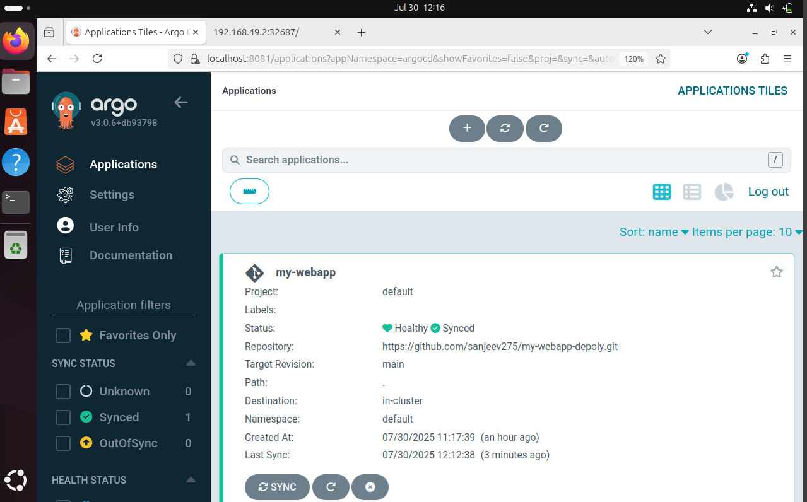

# jenkins-docker-argocd-pipeline
# 🚀 End-to-End CI/CD Pipeline with Jenkins, SonarQube, Docker & ArgoCD

This repository showcases a complete **CI/CD pipeline** for a Java-based web application using modern DevOps tools.  
It demonstrates how to go from **code commit → build → quality check → Docker image → Kubernetes deployment**  
all automated via **Jenkins** and **ArgoCD**.

---

## ✨ Features

- **Jenkins Declarative Pipeline**
  - Automated build and package with Maven
  - Code quality analysis with SonarQube
  - Build and push Docker image
  - Update Kubernetes manifests in GitHub

- **SonarQube Integration**
  - Ensures code quality and security scanning before deployment

- **Dockerized Application**
  - Custom Docker image built from Maven WAR/JAR
  - Push to DockerHub registry

- **ArgoCD for Continuous Deployment**
  - GitOps workflow to deploy new images to Kubernetes
  - Automated sync and self-heal enabled

- **Kubernetes Deployment**
  - Declarative manifests (`deployment.yaml`, `service.yaml`)
  - Scalable and reliable deployment to cluster

---

## 🛠️ Tech Stack

- **Java 21** (OpenJDK)
- **Maven**
- **Jenkins**
- **SonarQube**
- **Docker**
- **Kubernetes**
- **ArgoCD**
- **GitHub**

---

## 🔄 Workflow

1. **Code Commit**  
   Developer pushes code to GitHub.

2. **Build & Quality Check**  
   Jenkins:
   - Clones repo  
   - Runs Maven build  
   - Performs SonarQube code analysis

             
     

3. **Docker Image Build & Push**  
   Jenkins builds Docker image and pushes it to DockerHub.

4. **Manifest Update**  
   Jenkins updates `deployment.yaml` with new image tag and pushes back to GitHub.

     

6. **Continuous Deployment via ArgoCD**  
   ArgoCD detects the change in GitHub → Syncs manifests → Updates app in Kubernetes.
     

---

